# medica


This is a hospital management application built using Flutter. The app handles two main roles: patient and doctor. It leverages various technologies and architectural patterns to provide a robust and scalable solution for managing hospital operations.

## Features

- **User Roles**:
    - **Patient**
    - **Doctor**
- **Authentication and Profile Management**
    - User registration
    - Profile management
- **Home Page**
- **Search Functionality**
    - Search for doctors
    - Search for patients
- **Appointment Management**
    - Book appointments
    - Manage appointments
- **Virtual Appointments**
    - Integrated with Zego Cloud for video and voice calls

## Technology Stack

- **Flutter**: For building the cross-platform mobile application.
- **BLoC**: Used for state management.
- **GoRouter**: Used for navigation.
- **Freezed**: For generating immutable data classes.
- **Retrofit**: For API calls and network management.
- **Injectable**: For dependency injection and service locator.
- **MVVM Architecture**: Ensures separation of concerns and modularity.
- **flutter_secure_storage**: For secure storage of tokens.
- **Themes**: Supports both light and dark modes.
## Screenshots

### Authentication
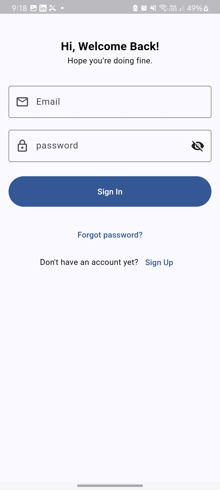
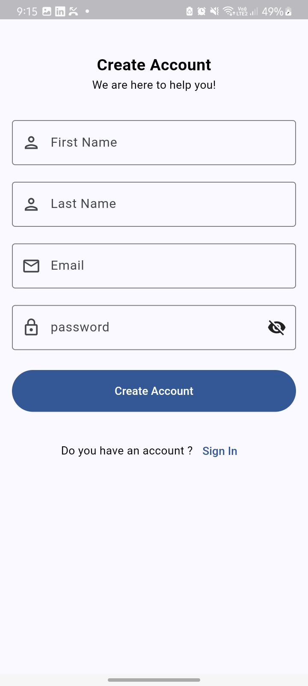
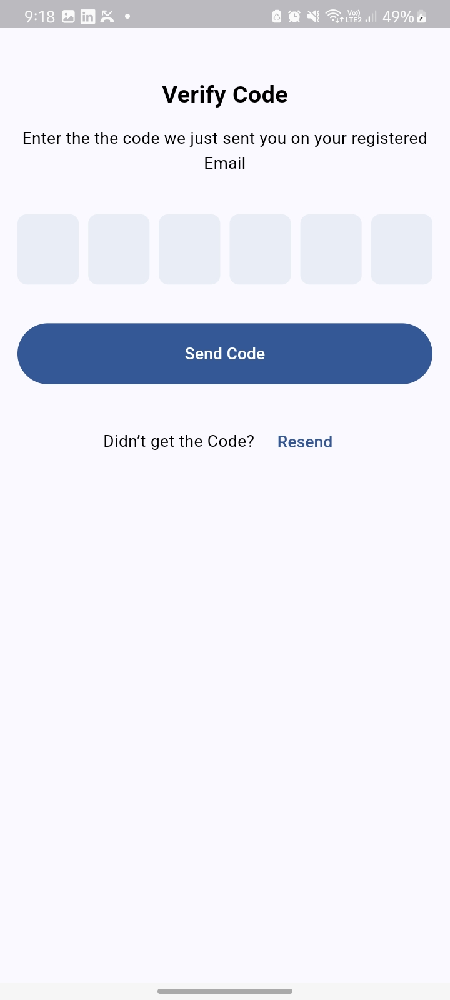
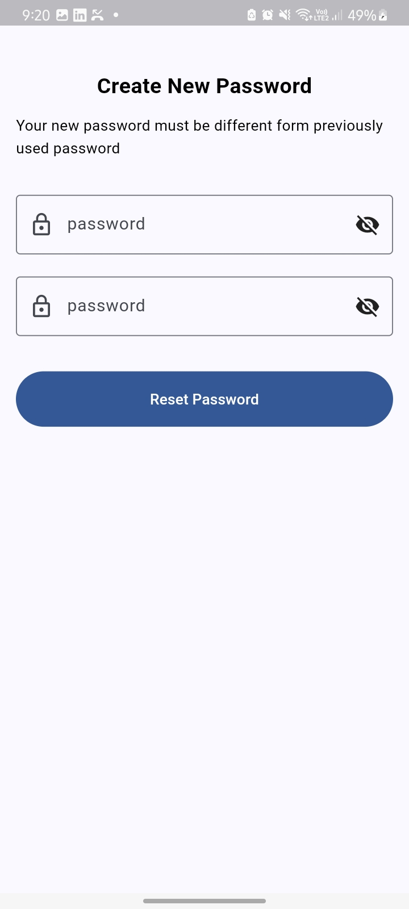
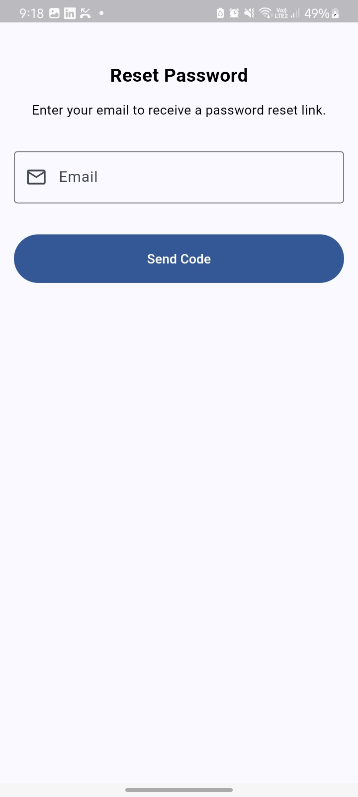


### Home Page
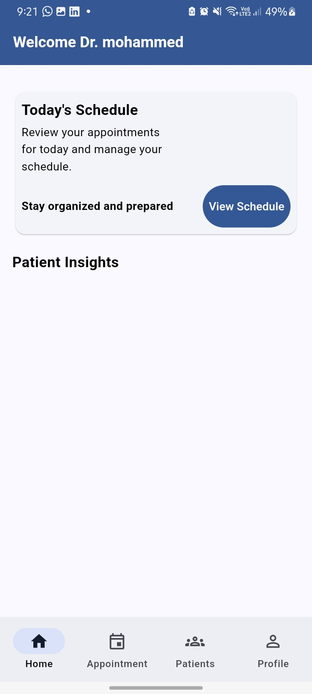
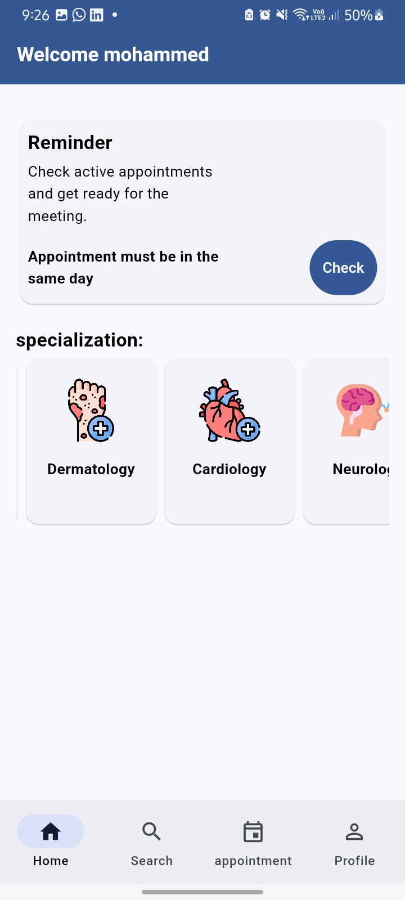

### Profile
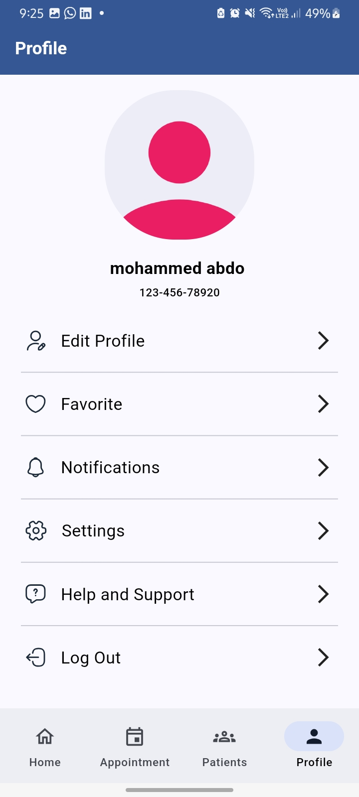
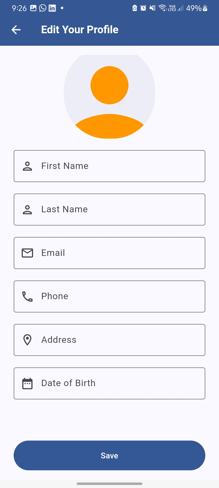

### Search
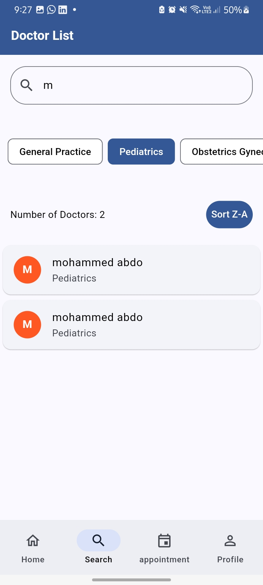

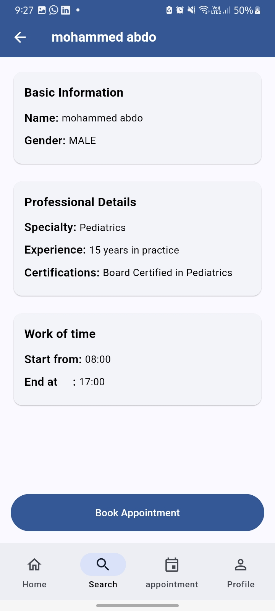
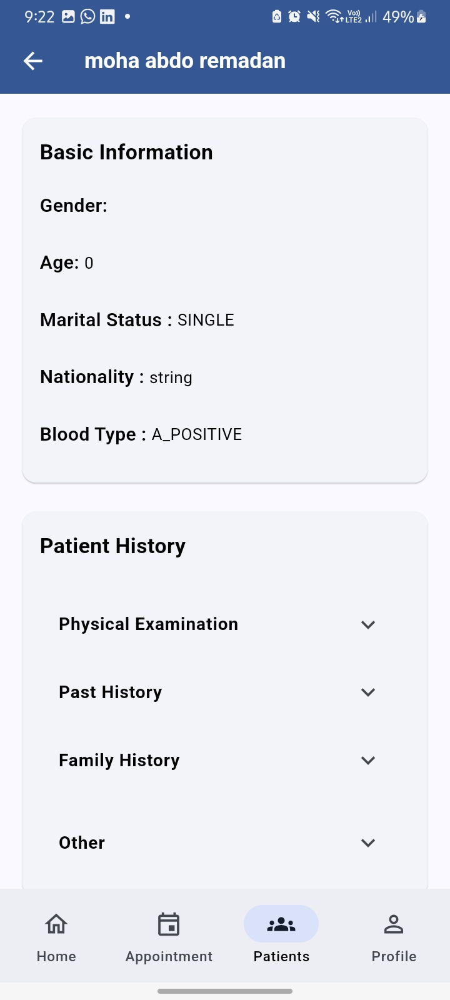

### Appointment
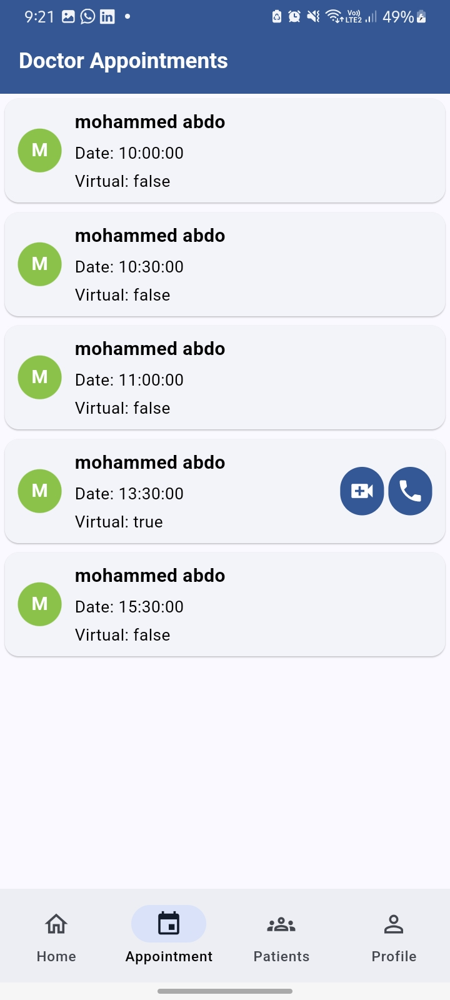
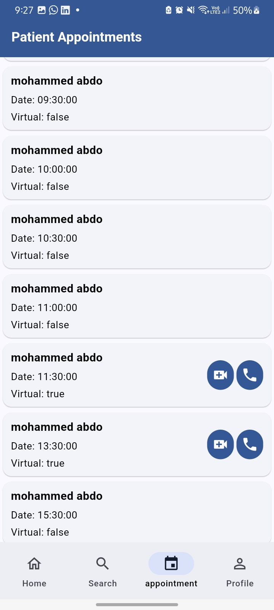
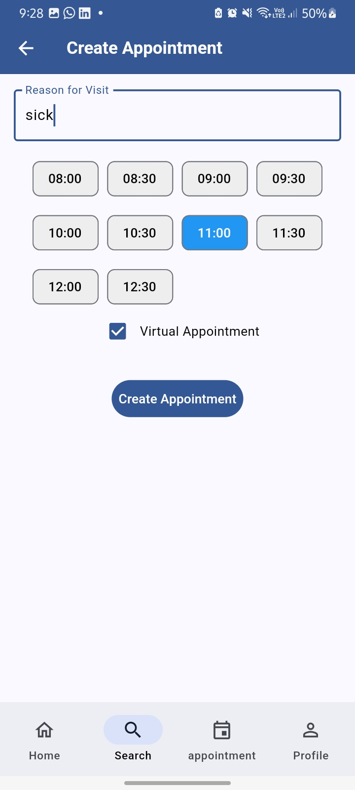
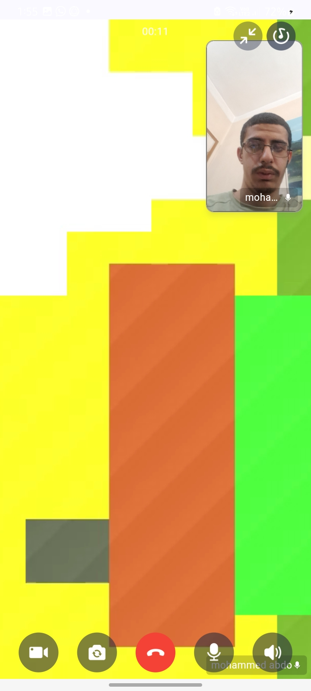
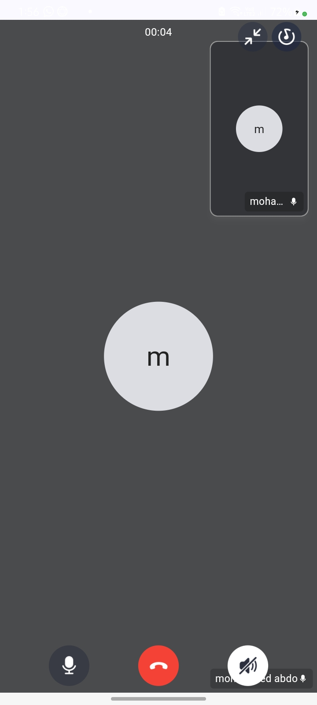


## Getting Started

### Prerequisites

- [Flutter](https://flutter.dev/docs/get-started/install)
- [Dart](https://dart.dev/get-dart)
- [Zego Cloud SDK](https://www.zegocloud.com/)

### Installation

1. **Clone the repository**
   ```bash
   git clone https://github.com/MohammedFlutter/hms.git
   cd hms
2. **Install dependencies**
   ```bash
   flutter pub get
3. **Generate code**
   ```bash
   flutter pub run build_runner build --delete-conflicting-outputs
   
